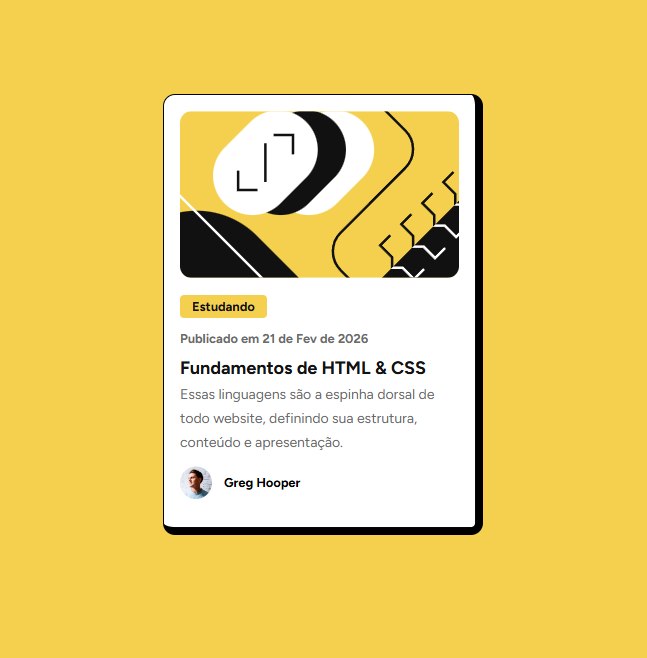
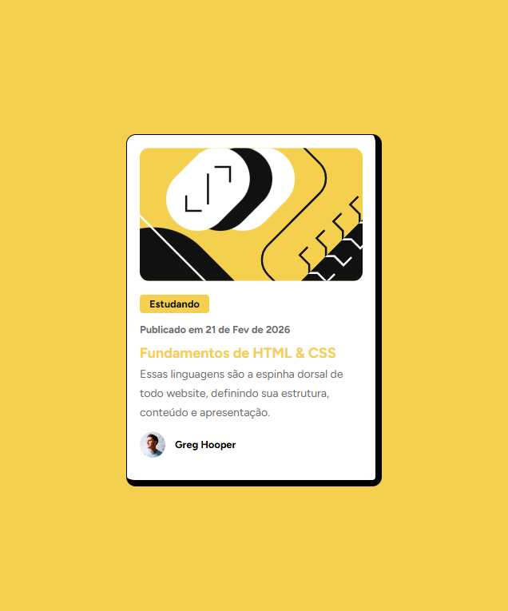

# Frontend Mentor - Blog preview card solution

Esta é uma solução para o  [desafio Blog preview card do Frontend Mentor](https://www.frontendmentor.io/challenges/blog-preview-card-ckPaj01IcS).

## Overview

### O Desafio

Usuários podem:

- Interagir com um elemento da página ao passar o mouse sobre ele

### Screenshots

## Meu Processo

### Desenvolvido com

- [React](https://react.dev/)
- [Vite](https://vite.dev/)
- [Tailwind CSS](https://tailwindcss.com/)

### Objetivos

Mais uma vez, agora com esse segundo desafio, aplicar mais um pouco dos meus conhecimentos com React, uma tecnologia que eu pretendo priorizar muito em meus estudos.

E pra deixar o card um pouco mais "interativo", a data carregada na visualização sempre será o dia atual, formatado a partir de uma função que criei para esse componente.

### Deploy
[Blog Preview Card](https://ktrindade-blog-preview-card.netlify.app/)

